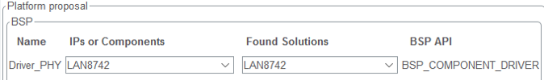

# Implementing a LwIP and FreeRTOS™ v1 UDP echo server on the STM32F7 series
---
## Introduction
In this article, we go through the necessary steps to create a working UDP echo server for the STM32F767 MCU. This demo is applicable to other F7 series microcontrollers with some minor differences in memory addresses depending on the model. This resulting project is available on our GitHub STM32 hotspot through this link (hyperlink to be added).
## Prerequisites
---
**Hardware:**

- [NUCLEO-F767ZI](https://www.st.com/en/microcontrollers-microprocessors/stm32f767zi.html#overview)

**Software:**

- [STM32CubeIDE v1.18.1](https://www.st.com/en/development-tools/stm32cubeide.html)
- [STM32CubeMX v6.14.1](https://www.st.com/en/development-tools/stm32cubemx.html)
- Packet generator, for example, [Packet Sender](https://packetsender.com/download)
- (Optional) DHCP server, for example, [Tftpd32](http://tftpd32.jounin.net/) 
## STM32CubeMX project configuration
To create a new project in STM32CubeMX for the Nucleo-F767 board, start by launching STM32CubeMX and clicking on **[New Project]**. In the **"Board Selector"** tab, locate and select the **[NUCLEO-F767ZI]** board. After doing so, a pop-up will appear asking, "**Initialize all peripherals in default mode?** Choose **[No]** to avoid applying default configurations to the peripheral. Once the project is created, we proceed by clicking on **[Pinout]** and selecting **[Clear Pinouts]** to remove all the default pin assignments. After doing this step, we can finally start configuring our project.
### Clock configuration
1. **Access the RCC (reset and clock control) settings**:
	- In the "**Pinout & Configuration"** tab, locate and select the **RCC** peripheral from the left-hand panel.
2. **Set HSE to bypass mode**:
	- This mode is typically used when an external oscillator (for example, a clock signal from the ST-LINK debugger) is driving the HSE input.
	- Under the RCC settings, configure the **High-Speed External Clock (HSE)** to **[Bypass Mode]**.
3. **Navigate to the "Clock Configuration" tab**:
	- Switch to the **Clock Configuration** tab to configure the clock tree.
4. **Set the core to maximum frequency**:
	- Adjust the settings in the clock tree to achieve the maximum frequency for the STM32F767 core, which is **216 MHz**.


In STM32CubeMX, it is recommended to configure a different timebase than SysTick when using FreeRTOS™ to avoid potential conflicts. To do this, navigate to the **"Pinout & Configuration"** tab and select the SYS peripheral. In the Timebase Source dropdown menu, choose a timer other than SysTick. **TIM6** is a suitable option because it is a simple timer with no additional complexity, making it ideal for this purpose.


### Cortex®-M7 configuration

To optimize performance and ensure memory protection, enable **[Instruction Cache (ICACHE)]** and **[Data Cache (DCACHE)]** in STM32CubeMX. Navigate to the **"Cortex-M7"** settings under the **"System Core"** section. Enable the **Memory Protection Unit (MPU)** and set it to **[Background Region Privileged access only + MPU Disabled during hard fault]** mode. Configure the MPU regions as shown in the provided image.
For example, set "**Region 0"** with a base address of **0x0**, **4GB size**, and access permissions as **ALL ACCESS NOT PERMITTED**. Similarly, configure **Region 1** and **Region 2** with their respective base addresses, sizes, and access permissions. These settings ensure efficient memory management and protection for your application.


### Ethernet configuration

To configure Ethernet for the Nucleo-F767 board in STM32CubeMX, enable the **Ethernet** peripheral in the "**Pinout & Configuration"** tab. Set it to **[RMII mode]**, as this is the mode supported on the board. Next, enable the **[Ethernet interrupt]** and set its **preemption priority** to **[5]**, which is required by **FreeRTOS™** to ensure that its functions can be called from the interrupt handler. Additionally, configure the speed of the Ethernet-related **GPIO pins** to **[Very High]** to support the high-speed data transfer required for Ethernet communication.


### FreeRTOS™ configuration

To enable **FreeRTOS™** in STM32CubeMX, go to the **Middleware** section and activate **FreeRTOS™** with the **CMSIS_V1 API**. The **CMSIS_V2 API** is not supported for the STM32F7 series. Once enabled, navigate to the **"Tasks and Queues"** tab and locate the **defaultTask**. Increase the **stack size** of the defaultTask to **[512 words]** to ensure sufficient memory allocation for task execution. This adjustment is crucial for handling the application's requirements without running into stack overflow issues.


### LwIP configuration

To configure **LwIP** in STM32CubeMX, start by enabling the **LwIP** stack in the **"Middleware"** section. For IP assignment, use **DHCP** to automatically obtain an IP address. If manual configuration is preferred, disable DHCP and assign a static IP address. Next, navigate to the "**Platform Settings"** tab and select **LAN8742** in both dropdown boxes. The **LAN8742** driver is compatible with the **LAN8740** Ethernet PHY device present on the Nucleo-F767 board, ensuring proper Ethernet communication.


In the **"Key options"** tab, make the following adjustments:
- Set **MEM_SIZE** to **16*1024** to define the heap size. This heap will later be relocated to **D2 SRAM**.
- Enable **LWIP_NETIF_LINK_CALLBACK** to detect Ethernet cable plugging and unplugging events.
- Configure the **LWIP_RAM_HEAP_POINTER** to point to the appropriate memory address in **D2 SRAM** which in our case **0x20078000**.


These configurations ensure that the LwIP stack is properly set up for Ethernet communication and optimized memory usage.
### Code generation

Once all configurations are complete, select a destination folder and generate the project files by clicking on the **[Generate Code]** button. In this project, we selected the option to generate a source and header file for each peripheral, ensuring better code organization. While we use STM32CubeIDE as the development environment in this example, the generated project is also compatible with other supported IDEs. Ensure that the selected toolchain matches your preferred IDE during the code generation process.

## Customizing the generated code

After configuring STM32CubeMX, the final step is to adjust the generated code to ensure the project functions as intended.

### Modifying the linker script (not valid for Keil/IAR)

This step can be skipped for **Keil®** and **IAR**, as these IDEs support placing variables at specific addresses directly in the C code. You need to make the following adjustments to **STM32F767ZITX_FLASH.ld** as shown below.
```c
MEMORY
{
  RAM    (xrw)    : ORIGIN = 0x20000000,   LENGTH = 512K
  FLASH    (rx)    : ORIGIN = 0x8000000,   LENGTH = 2048K
  Memory_B1(xrw)   : ORIGIN = 0x2007C000, LENGTH = 0xA0
  Memory_B2(xrw)   : ORIGIN = 0x2007C0A0, LENGTH = 0xA0
}
...
  .RxDecripSection (NOLOAD) : { *(.RxDecripSection) } >Memory_B1
  .TxDescripSection (NOLOAD) : { *(.TxDecripSection) } >Memory_B2 
```
### Modify freertos.c

In the **default task** created by STM32CubeMX, we add a function to initialize the **UDP server thread**. Include the provided UDP_echoserver.c file by adding it to the **src** folder (source files) of your project. This file contains the implementation of the UDP echo server, which handles incoming UDP packets. Ensure that the initialization function is properly called within the default task to start the server.
```c
...
/* USER CODE BEGIN PFP */
extern void udpecho_init(void);
/* USER CODE END PFP */
...
void StartDefaultTask(void const * argument)
{
  /* init code for LWIP */
  MX_LWIP_Init();
  /* USER CODE BEGIN 5 */
  udpecho_init();
  /* Infinite loop */
  for(;;)
  {
	  osThreadTerminate(defaultTaskHandle);
  }
  /* USER CODE END 5 */
}
```
### Explaining the UDP echo server source code

The server listens for incoming UDP packets on a specified port, processes the data, and sends the same data back to the sender. Below is a summary of its key components:

1. **Initialization (udpecho_init)**:
    - The udpecho_init function creates a new thread (udpecho_thread) with a specified priority to handle the echo server operations.
2. **UDP echo server thread (udpecho_thread)**:
    - A new UDP connection is created using netconn_new (NETCONN_UDP).
    - The server binds to UDP_SERVER_PORT (port 7) and listens for incoming packets.
    - Upon receiving a packet (netconn_recv), it retrieves the sender's IP address and port using netbuf_fromaddr and netbuf_fromport.
    - The server sends the received data back to the sender using netconn_send.
    - The buffer is deleted after processing to free memory.
3. **Thread priority and port**:
    - The thread runs at a priority level defined by UDPECHO_THREAD_PRIO.
    - The server listens on port 7, commonly used for echo services.
## Testing the application

Compile the code. Using an application or utility like **Packet Sender**, you can test whether the server is successfully receiving UDP test messages. The board can obtain its IP address in two ways: either dynamically from a DHCP server running on the testing computer or network using, for example, Tftpd32, or through a statically defined IP address. In this example, we format a UDP packet to send to port 7 using the IP address, whether it is assigned by the DHCP server or manually configured.

After this, you should see that the response echoed back by the UDP server running on the board, confirming that the server is functioning correctly and everything is working as intended.

## Conclusion

With this information, you can now develop a basic application using DHCP with the LwIP middleware. For more advanced implementations, check out our demonstration projects on GitHub, such as those for the STM32F7 series, or connect with us through the ST community for support.
## Related links

Here are some useful links to assist with development using the LwIP middleware within ST’s ecosystem:

- [UM1713: Developing applications on STM32Cube with LwIP TCP/IP stack](https://www.st.com/content/ccc/resource/technical/document/user_manual/65/e8/20/db/16/36/45/f7/DM00103685.pdf/files/DM00103685.pdf/jcr:content/translations/en.DM00103685.pdf "https://www.st.com/content/ccc/resource/technical/document/user_manual/65/e8/20/db/16/36/45/f7/dm00103685.pdf/files/dm00103685.pdf/jcr:content/translations/en.dm00103685.pdf")
- [LwIP documentation](https://www.nongnu.org/lwip/2_1_x/index.html)
- [GitHub: STMicroelectronics](https://github.com/STMicroelectronics)
- [UM1974: STM32 Nucleo-144 boards (MB1137)](https://www.st.com/resource/en/user_manual/um1974-stm32-nucleo144-boards-mb1137-stmicroelectronics.pdf "https://www.st.com/resource/en/user_manual/um1974-stm32-nucleo144-boards-mb1137-stmicroelectronics.pdf")
- [RM0410: STM32F76xxx and STM32F77xxx advanced Arm®-based 32-bit MCUs](https://www.st.com/resource/en/reference_manual/rm0410-stm32f76xxx-and-stm32f77xxx-advanced-armbased-32bit-mcus-stmicroelectronics.pdf "https://www.st.com/resource/en/reference_manual/rm0410-stm32f76xxx-and-stm32f77xxx-advanced-armbased-32bit-mcus-stmicroelectronics.pdf")
